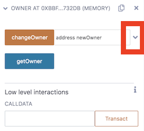

## 与已部署合约中的函数交互

部署的合约中有哪些功能？函数采用哪些参数，如何确保输入正确的输入类型？使用特定功能是否需要消耗 gas？当你点击一个函数的 **transact** 按钮时会发生什么——也就是说，当你想通过一个函数进行交易时会发生什么？

我们将在本章中讨论这些问题。

1. 在部署和运行页面的底部，通过单击插入符号打开合约——因此插入符号指向下方。

    

2. 该合约有2个功能。单击更改所有者右侧的插入符号（红色轮廓）将打开输入，以便您可以将参数放入单独的输入框中。

如果这个合约已经导入了其它合约，那么导入的合约的功能也会在这里可见。

3. 其中一项功能有一个蓝色按钮。蓝色按钮的功能是 **pure** 或 **view** 功能。这意味着他们只是在读取一个属性或返回一个值。换句话说，它们没有保存任何东西——所以它们是免费的（它们不花钱）。其它颜色的函数——通常是橙色（取决于 Remix 主题）会消耗 gas，因为它们正在保存信息。它们正在创建一个**交易**。
4. 2_Owner.sol 没有**应付**功能。如果是这样，按钮的颜色将是红色。应付功能允许您将以太币发送到该功能。要使用支付功能发送 ETH，您将要发送的金额放在屏幕顶部的**值**字段中。
5. 在 JSVM 中，您不需要批准交易。当使用更真实的测试环境或使用主网时——您需要批准交易才能通过。批准交易需要 ETH。要在使用 Injected Web3 时批准交易，您通常会使用 MetaMask。在 MetaMask 中，您可以选择网络——一个使用测试 ETH 的测试网络，或者您可以使用需要真实 ETH 的主网。

