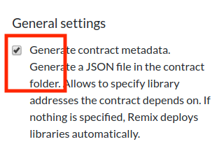

## 部署库

之前章节中的**库**与**合约**在同一个文件中。但是，它们不会一起部署并且将具有不同的地址。

为了使用库，调用合约必须具有库的**地址**。

但是库的地址不是直接在 solidity 代码中制定的。调用合约的编译字节码包含一个**占位符**，其中库的**地址**将放入其中。

在部署**调用合约**时，Remix 将在合约的**元数据**中查找库的地址，并将使用地址更新占位符。

因此，在部署调用库的合约之前，您需要生成合约的元数据（AKA 它的**构建工件**），然后您需要将库的地址输入到元数据文件中。

合约的元数据在**编译时**生成。

让我们设置 Remix 以生成**元数据文件**。

- 单击图标面板中的设置图标进入设置模块。

   

- 并检查第一个选项`生成合同元数据`。

# 编译并生成元数据（JSON）文件

1. 打开 Solidity 编译器。

2. 编译 `2_contractSimpleLibrary.sol` 。

3. 切换到文件资源管理器。

4. 导航到新创建的 JSON 文件。

   - 它必须在以下文件夹中：

   **browser/.learneth/DeployWithLibraries/2_Generate_Metadata/artifacts/**

5. 选择从合约中创建的新创建的 JSON 文件。它与合约 `sample` **同名**，但扩展名为 **json**：`sample.json`（不要选择库的元数据 `contractSimpleLibrary.json`）

在下一步中，我们将对元数据文件进行一些调整。

