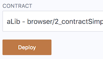

切换到 `Depoly & Run` 模式

 

- 选择 JavaScript VM Environment 并在已编译合约列表中选择 `sampleContract` 合约。
- 点击 `Deploy`

终端应输出类似 `错误创建样本：<address>不是有效地址。请检查提供的地址是否有效。`之类的内容。

预期：**我们已将 `autoDeployLib` 设置为 false，因此 Remix 期望有一个地址，而不仅仅是 `<address>`**

所以我们需要部署库来获取它的地址。

- 在已编译合约列表中选择库 `aLib` 并点击 `Deploy`

- 单击剪贴板图标以复制库的地址。

- 将其粘贴到**合同样本**中的元数据 JSON 中。
- 在 `Run transaction `模块中重新选择 `sampleContract` 合约并点击部署。
- 部署现在应该成功了。

